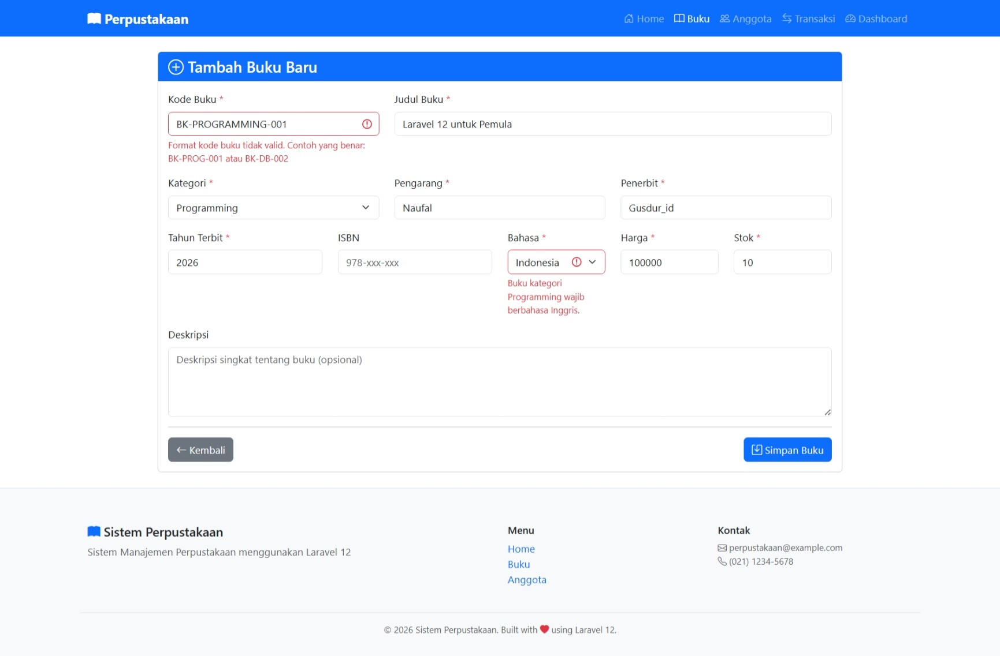
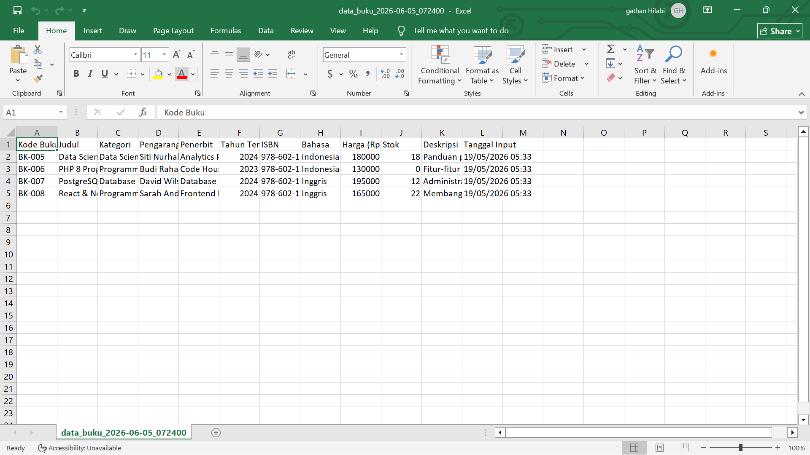

# Pertemuan 12 - CRUD Buku Dengan Laravel

**Mata Kuliah:** Pemrograman Website 2  
**Kode MK:** INF2419  
**NIM:** 60324059  
**Nama:** Gathan Hilabi  
**Dosen:** Mohammad Reza Maulana, M.Kom  
**Universitas:** UIN K.H. Abdurrahman Wahid Pekalongan

---

## Deskripsi

Proyek ini merupakan implementasi Pertemuan 12 mata kuliah Pemrograman Website 2,
yaitu implementasi lengkap operasi CRUD (Create, Read, Update, Delete) untuk data buku
menggunakan Laravel. Fokus utama adalah Form Handling, Laravel Validation dengan Form Request,
CSRF Protection, Flash Messages, Eloquent CRUD, serta fitur tambahan berupa
Validation Rules Advanced, Bulk Delete, dan Export CSV.
Studi kasus yang digunakan adalah Sistem Manajemen Perpustakaan.

---

## Tugas 1 — Validation Rules Advanced (30%)

- [x] Custom Rule `KodeBukuFormat` dibuat dengan `php artisan make:rule KodeBukuFormat`
- [x] Format kode buku divalidasi dengan regex: `BK-[2-4 huruf kapital]-[3 digit angka]`
- [x] Contoh valid: `BK-PROG-001`, `BK-DB-002`, `BK-WD-010`
- [x] Conditional validation: jika kategori `Programming`, field `bahasa` wajib `Inggris`
- [x] Conditional validation: jika tahun terbit < 2000, stok maksimal 5
- [x] Semua error message dalam Bahasa Indonesia
- [x] `StoreBukuRequest` diperbarui dengan custom rule dan conditional validation
- [x] `UpdateBukuRequest` diperbarui dengan ignore ID saat cek `unique` (mencegah false error saat update)

---

## Tugas 2 — Bulk Delete Operations (35%)

- [x] Route `POST /buku/bulk-delete` terdaftar dengan nama `buku.bulk-delete`
- [x] Method `bulkDelete()` di `BukuController` menghapus banyak buku sekaligus
- [x] Validasi: minimal 1 buku harus dipilih, setiap ID harus ada di database
- [x] Checkbox per buku tampil sebagai pill `[☐ Pilih]` di pojok kiri atas setiap card
- [x] Checkbox "Pilih Semua" sejajar dengan header grid
- [x] Tombol "Hapus Terpilih" muncul otomatis saat ada buku yang dipilih
- [x] Counter jumlah buku terpilih ditampilkan di tombol
- [x] Konfirmasi SweetAlert2 sebelum eksekusi bulk delete
- [x] Flash message menampilkan jumlah buku yang berhasil dihapus

---

## Tugas 3 — Export Buku ke CSV (35%)

- [x] Route `GET /buku/export` terdaftar dengan nama `buku.export`
- [x] Method `export()` di `BukuController` menghasilkan file CSV
- [x] BOM UTF-8 ditambahkan agar karakter Indonesia terbaca benar di Excel
- [x] Header kolom CSV: Kode Buku, Judul, Kategori, Pengarang, Penerbit, Tahun Terbit, ISBN, Bahasa, Harga, Stok, Deskripsi, Tanggal Input
- [x] Nama file otomatis menggunakan timestamp: `data_buku_YYYY-MM-DD_HHmmss.csv`
- [x] Tombol "Export CSV" tersedia di halaman daftar buku
- [x] File langsung didownload tanpa disimpan di server (menggunakan `response()->stream()`)

---

## File yang Dibuat / Diubah

| File                                      | Keterangan                                                     |
| ----------------------------------------- | -------------------------------------------------------------- |
| `app/Rules/KodeBukuFormat.php`            | Custom validation rule format kode buku — Tugas 1              |
| `app/Http/Requests/StoreBukuRequest.php`  | Form Request create buku + custom rule + conditional — Tugas 1 |
| `app/Http/Requests/UpdateBukuRequest.php` | Form Request update buku + ignore ID unique — Tugas 1          |
| `app/Http/Controllers/BukuController.php` | Tambah method `bulkDelete()` dan `export()` — Tugas 2 & 3      |
| `resources/views/buku/index.blade.php`    | Tambah checkbox bulk delete + tombol export CSV — Tugas 2 & 3  |
| `routes/web.php`                          | Tambah route `bulk-delete` dan `export`                        |

---

## Struktur Folder Penting

```
perpustakaan-laravel/
│
├── app/
│   ├── Http/
│   │   ├── Controllers/
│   │   │   └── BukuController.php        ← CRUD + bulkDelete() + export()
│   │   └── Requests/
│   │       ├── StoreBukuRequest.php       ← Validasi tambah buku
│   │       └── UpdateBukuRequest.php      ← Validasi edit buku (ignore ID)
│   │
│   ├── Models/
│   │   └── Buku.php                       ← Eloquent Model
│   │
│   ├── Rules/
│   │   └── KodeBukuFormat.php             ← Custom rule format kode buku
│   │
│   └── View/
│       └── Components/
│           └── BukuCard.php               ← Class Blade Component
│
├── database/
│   ├── migrations/
│   │   └── xxxx_create_buku_table.php     ← Struktur tabel buku
│   └── seeders/
│       └── BukuSeeder.php                 ← Data dummy buku
│
├── resources/
│   └── views/
│       ├── layouts/
│       │   └── app.blade.php              ← Layout utama + flash messages
│       ├── components/
│       │   └── buku-card.blade.php        ← Template Blade Component card buku
│       └── buku/
│           ├── index.blade.php            ← Daftar buku + bulk delete + export
│           ├── create.blade.php           ← Form tambah buku
│           ├── edit.blade.php             ← Form edit buku
│           └── show.blade.php             ← Detail buku
│
└── routes/
    └── web.php                            ← Semua route aplikasi
```

---

## Cara Menjalankan

### 1. Clone repo

```bash
git clone https://github.com/G-than12/Tugas-12.git
cd [Tugas-12]
```

### 2. Install dependencies

```bash
composer install
```

### 3. Setup environment

```bash
cp .env.example .env
php artisan key:generate
```

### 4. Konfigurasi database di `.env`

```env
DB_DATABASE=perpustakaan_laravel
DB_USERNAME=root
DB_PASSWORD=
```

### 5. Buat database di phpMyAdmin

Buat database baru bernama `perpustakaan_laravel`

### 6. Jalankan migration + seeder

```bash
php artisan migrate:fresh --seed
```

### 7. Jalankan server

```bash
php artisan serve
```

---

## URL Testing

| URL                 | Method | Keterangan                                  |
| ------------------- | ------ | ------------------------------------------- |
| `/dashboard`        | GET    | Halaman dashboard                           |
| `/buku`             | GET    | Daftar buku + bulk delete + export CSV      |
| `/buku/create`      | GET    | Form tambah buku                            |
| `/buku`             | POST   | Simpan buku baru                            |
| `/buku/{id}`        | GET    | Detail buku                                 |
| `/buku/{id}/edit`   | GET    | Form edit buku                              |
| `/buku/{id}`        | PUT    | Update data buku                            |
| `/buku/{id}`        | DELETE | Hapus satu buku                             |
| `/buku/bulk-delete` | POST   | Hapus banyak buku sekaligus — Tugas 2 ✅    |
| `/buku/export`      | GET    | Download data buku sebagai CSV — Tugas 3 ✅ |
| `/buku/search`      | GET    | Pencarian & filter buku                     |

---

## Validasi Kode Buku (Tugas 1)

Format yang diterima: `BK-[SINGKATAN]-[NOMOR]`

| Contoh               | Status                               |
| -------------------- | ------------------------------------ |
| `BK-PROG-001`        | ✅ Valid                             |
| `BK-DB-002`          | ✅ Valid                             |
| `BK-WD-010`          | ✅ Valid                             |
| `BK-NET-099`         | ✅ Valid                             |
| `BK-001`             | ❌ Tidak valid                       |
| `PROG-001`           | ❌ Tidak valid                       |
| `BK-PROGRAMMING-001` | ❌ Tidak valid (singkatan > 4 huruf) |

---

## Screenshot

### Tugas 1 — Validation Rules Advanced



### Tugas 2 — Bulk Delete


### Tugas 3 — Export CSV



